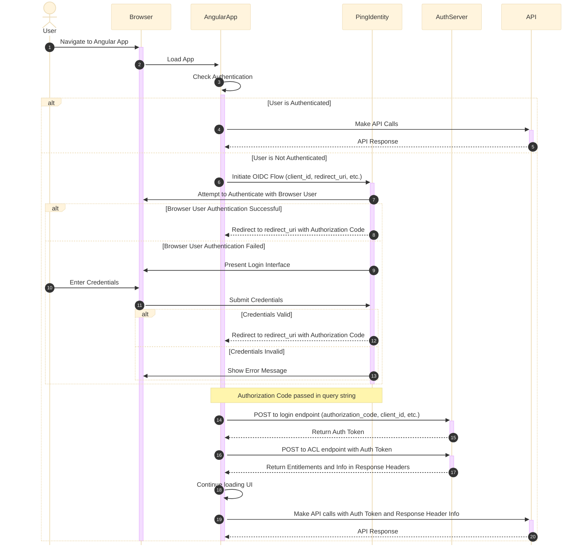

This diagram illustrates the complete flow you described, including:
1. User navigating to the Angular App
2. Angular App checking authentication
3. Two paths:
   - Authenticated: making API calls directly
   - Unauthenticated: initiating OIDC flow
4. OIDC flow with Ping Identity:
   - Attempting to authenticate with the browser's logged-in user
   - Presenting a login interface if needed
   - Redirecting back to the Angular App with authorization code
5. Angular App exchanging authorization code for auth token with AuthServer
6. Angular App requesting ACL information from AuthServer
7. AuthServer returning entitlements and additional information
8. Angular App continuing to load UI and make API calls with obtained information

The diagram includes all the steps in the authentication and authorization process, showing the interactions between the user, browser, Angular App, Ping Identity, AuthServer, and API.

---

---
