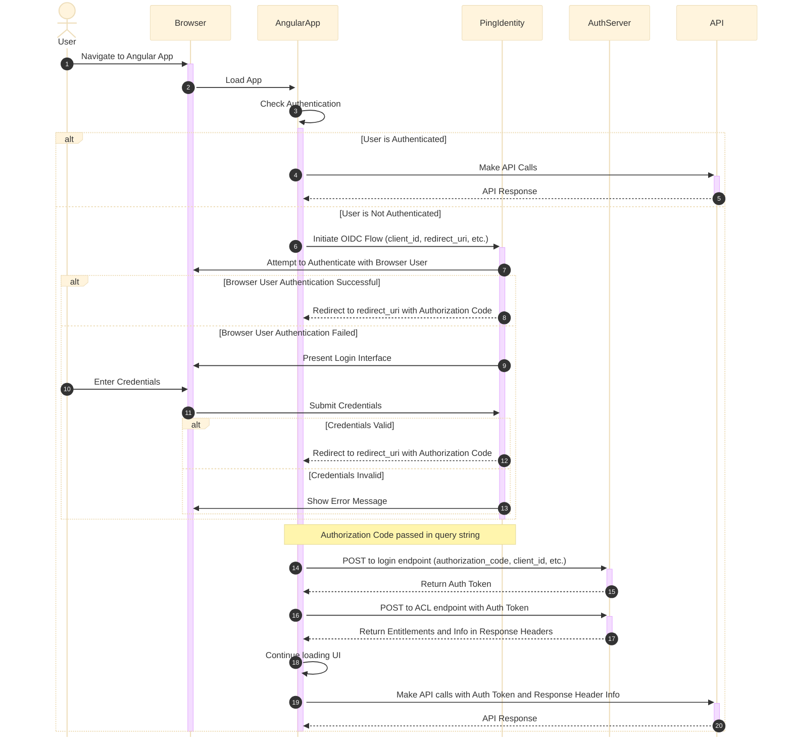

This diagram illustrates the complete flow you described, including:
1. User navigating to the Angular App
2. Angular App checking authentication
3. Two paths:
   - Authenticated: making API calls directly
   - Unauthenticated: initiating OIDC flow
4. OIDC flow with Ping Identity:
   - Attempting to authenticate with the browser's logged-in user
   - Presenting a login interface if needed
   - Redirecting back to the Angular App with authorization code
5. Angular App exchanging authorization code for auth token with AuthServer
6. Angular App requesting ACL information from AuthServer
7. AuthServer returning entitlements and additional information
8. Angular App continuing to load UI and make API calls with obtained information

The diagram includes all the steps in the authentication and authorization process, showing the interactions between the user, browser, Angular App, Ping Identity, AuthServer, and API.

---

---

@startuml
actor User
participant Browser
participant AngularApp
participant PingIdentity
participant AuthServer
participant API

User -> Browser : Navigate to Angular App
activate Browser

Browser -> AngularApp : Load App
activate AngularApp

AngularApp -> AngularApp : Check Authentication

alt User is Authenticated
    AngularApp -> API : Make API Calls
    activate API
    API --> AngularApp : API Response
    deactivate API
else User is Not Authenticated
    AngularApp -> PingIdentity : Initiate OIDC Flow (client_id, redirect_uri, etc.)
    activate PingIdentity
    PingIdentity -> Browser : Attempt to Authenticate with Browser User
    
    alt Browser User Authentication Successful
        PingIdentity --> AngularApp : Redirect to redirect_uri with Authorization Code
    else Browser User Authentication Failed
        PingIdentity -> Browser : Present Login Interface
        User -> Browser : Enter Credentials
        Browser -> PingIdentity : Submit Credentials
        
        alt Credentials Valid
            PingIdentity --> AngularApp : Redirect to redirect_uri with Authorization Code
        else Credentials Invalid
            PingIdentity -> Browser : Show Error Message
        end
    end
    deactivate PingIdentity

    note over PingIdentity, AngularApp : Authorization Code passed in query string

    AngularApp -> AuthServer : POST to login endpoint (authorization_code, client_id, etc.)
    activate AuthServer
    AuthServer --> AngularApp : Return Auth Token
    deactivate AuthServer

    AngularApp -> AuthServer : POST to ACL endpoint with Auth Token
    activate AuthServer
    AuthServer --> AngularApp : Return Entitlements and Info in Response Headers
    deactivate AuthServer

    AngularApp -> AngularApp : Continue loading UI
    AngularApp -> API : Make API calls with Auth Token and Response Header Info
    activate API
    API --> AngularApp : API Response
    deactivate API
end

deactivate AngularApp
deactivate Browser
@enduml

---

i need a mermaidjs flow for the process flow below

1. Create Install Story
2. Add all the required sub-tasks on the install story and assign all the sub-tasks to corresponding assignees. All the qa, test plan/execution tasks are assigned to the developer who owns the 'Testing' CTask of the corresponding CM Ticket
3. Create CM ticket with all required CTasks and assign all Ctasks to corresponding associates.
# In the case where 2 different teams are performing implementation as part of the same XX Ticket (for ex: CM23456), then it is required to create 2 'Implementation' Ctasks.
# In the case where some other external team performs the implementation and our team need to validate, then we need to assign the Implementation CTask to external team and 'Testing' and 'Validation' task to someone from our team (for ex: CM2345).
4. Create the install plan excel sheet and attach it to the CM ticket. Also attach the same excel sheet in the below sharepoint site. <sp_url>.
5. Get the CM ticket internally reviewed with someone in the team.
6. Submit the CM ticket for approvals.
7. Co-ordinate with squad lead and provide all details about the CM ticket so that the squad lead could fill the form in the below sharepoint site <url>.
8. Attend 'XXX-Rev(change)' meeting (on <day>) in which the high-level detail of the change is demonstrated to <person_name>.
9. Coordinate with the owner of the 'Testing' ctask and ensure that 'Testing' ctask is closed.
10. Ensure that the CM ticket is 'Audit compliant' at this stage. we can check the audit compliant at <url>.
11. Contact someone from the 'Assignment Group' and ensure that we get approvals on the CM ticket, the install plan etc. After this meeting, ensure that someone from A4 team (who belongs to <add_here> group) approves the CM ticket. IF any correction is suggested by the A4 team in the '<add_here>' weekly meeting, make that change and get their approval by chatting with them in the '<add_here>' teams group chat. Note: One/two days before attending to this meeting, post a message in '<add_here>' teams chat asking A4 team to review this change so that we can make any corrections before the meeting.
12. Promote the docker image or maven jar to 'docker-releases-local' or 'maven-releases-local' respectively one or two days before the prod install. Here is the document to promote changes <link_here>.
13. Complete the prod install on the day of the install and ensure that corresponding owners of the ctask will close their ctasks during the install.
14. Owner of the CM ticket should ensure that the entire CM ticket is also closed at the end of the install. The CM ticket needs to be closed within 24 hours of the install window.
15. Close the install story after the completion of the prod install.

