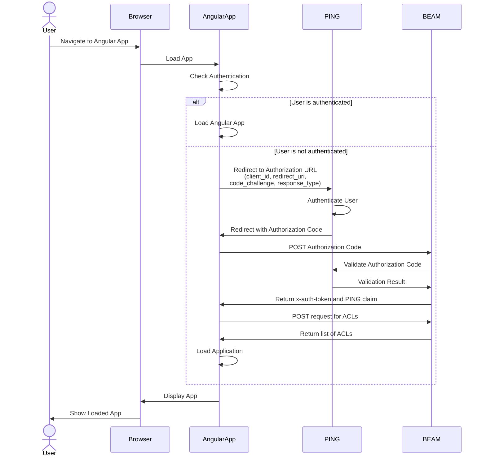
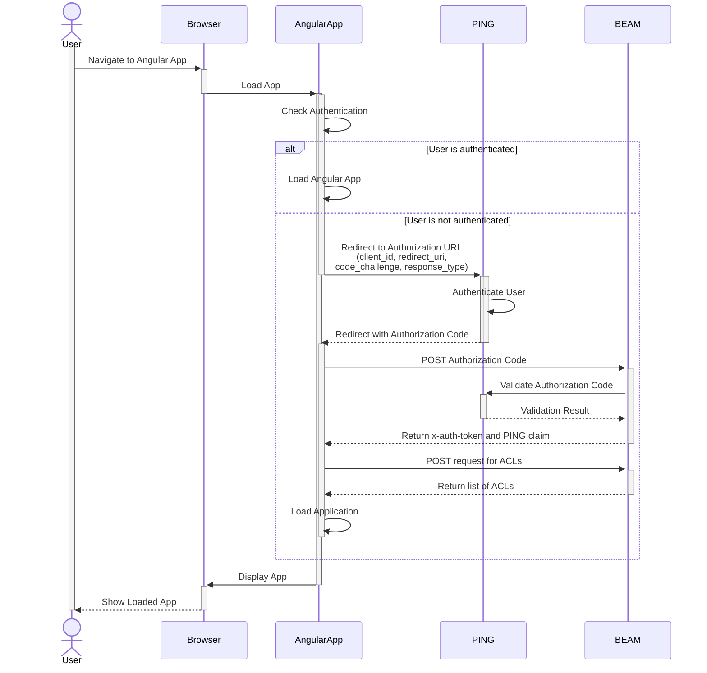

# Sequence Diagram without activation

```mermaid
sequenceDiagram
    actor User
    participant Browser
    participant AngularApp
    participant PING
    participant BEAM

    User->>Browser: Navigate to Angular App
    Browser->>AngularApp: Load App
    AngularApp->>AngularApp: Check Authentication

    alt User is authenticated
        AngularApp->>AngularApp: Load Angular App
    else User is not authenticated
        AngularApp->>PING: Redirect to Authorization URL<br>(client_id, redirect_uri,<br>code_challenge, response_type)
        PING->>PING: Authenticate User
        PING->>AngularApp: Redirect with Authorization Code
        AngularApp->>BEAM: POST Authorization Code
        BEAM->>PING: Validate Authorization Code
        PING->>BEAM: Validation Result
        BEAM->>AngularApp: Return x-auth-token and PING claim
        AngularApp->>BEAM: POST request for ACLs
        BEAM->>AngularApp: Return list of ACLs
        AngularApp->>AngularApp: Load Application
    end

    AngularApp->>Browser: Display App
    Browser->>User: Show Loaded App

```

---

```mermaid
sequenceDiagram
    actor User
    participant Browser
    participant AngularApp
    participant PING
    participant BEAM

    activate User
    User->>+Browser: Navigate to Angular App
    Browser->>+AngularApp: Load App
    deactivate Browser
    
    activate AngularApp
    AngularApp->>AngularApp: Check Authentication

    alt User is authenticated
        AngularApp->>AngularApp: Load Angular App
    else User is not authenticated
        AngularApp->>+PING: Redirect to Authorization URL<br>(client_id, redirect_uri,<br>code_challenge, response_type)
        deactivate AngularApp
        
        activate PING
        PING->>PING: Authenticate User
        PING-->>-AngularApp: Redirect with Authorization Code
        deactivate PING
        
        activate AngularApp
        AngularApp->>+BEAM: POST Authorization Code
        
        activate BEAM
        BEAM->>+PING: Validate Authorization Code
        PING-->>-BEAM: Validation Result
        BEAM-->>-AngularApp: Return x-auth-token and PING claim
        
        AngularApp->>+BEAM: POST request for ACLs
        BEAM-->>-AngularApp: Return list of ACLs
        
        AngularApp->>AngularApp: Load Application
        deactivate AngularApp
    end

    AngularApp->>+Browser: Display App
    deactivate AngularApp
    Browser-->>-User: Show Loaded App
    deactivate User

```
